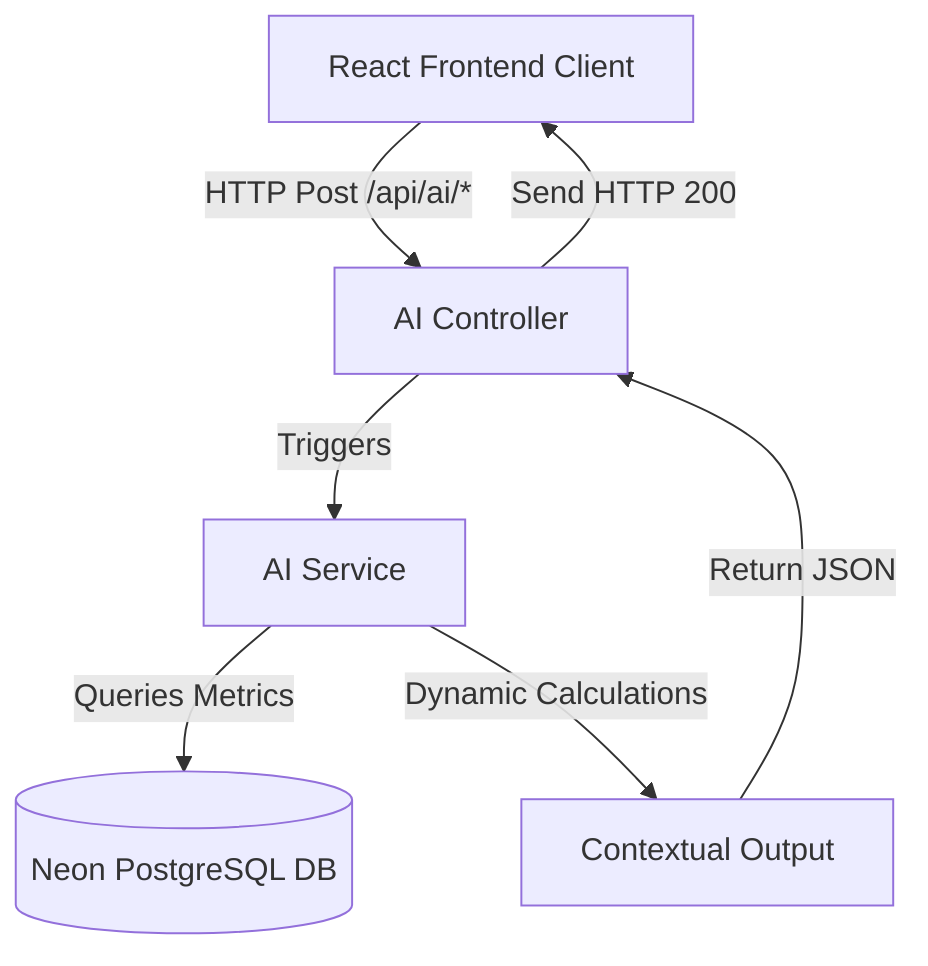

# Task B Technical Report: AI-Powered CRM Intelligence

**Prepared For**: Digital Heroes Evaluation Committee  
**System Name**: LeadFlow CRM AI Copilot Engine  
**Developer Role**: Lead Full-Stack & AI Engineer  

---

## 1. Executive Summary
LeadFlow CRM implements an AI CRM Copilot Engine. The intelligence layer provides context-aware features including lead scoring, automated interaction briefings, sales outreach drafts, meeting notes parsing, natural language searching, and a conversational CRM assistant. This report outlines the technical architecture, data flows, heuristic algorithms, and prompt strategy designed for these systems.

---

## 2. System Architecture & Data Flow

The AI layer is structured with clean separation of concerns, mapping routes to controllers, services, and repositories:

1. **API Routing Layer** (`/api/ai`): Mounted in Express app with token authentication and rate-limiting middleware.
2. **Controller Layer** (`ai.controller.ts`): Handles express requests, parses request bodies (e.g. `leadId`, `prompt`, `rawText`), and formats HTTP response envelopes.
3. **Service Layer** (`ai.service.ts`): Implements the core business logic, database queries (Prisma Client), and context assembly algorithms.

---

## 3. Core AI Module Specifications

### 3.1 AI Lead Scoring System
Calculates a lead conversion probability score (0–100) based on dynamic engagement indices:
* **Base Variables**: Company Size, Lead Source weightings (Referral/Website vs. Cold Outreach), Priority level.
* **Interaction Density**: Counts total `activityLogs` and `notes` associated with the target lead.
* **Heuristic Formula**:
  $$\text{Score} = \text{SourceWeight} + \text{PriorityWeight} + \text{ActivityDensity} - \text{InactionPenalties}$$
* **Outputs**: Numeric score, Conversion Probability classification (*High, Medium, Low*), Conversion/Risk factor breakdown.

### 3.2 AI Lead Summary (Briefing Generator)
Analyzes a lead's chronological notes and activity logs to compile a 2–4 sentence briefing:
* Gathers the latest recorded interaction notes.
* Contextualizes the buyer's target plan (e.g. Enterprise, standard, custom proposal request) and scheduled follow-ups.
* Returns objections summary and next touchpoint timer.

### 3.3 AI Outbound Email Generator
Generates contextual, editable sales email drafts mapping across six transactional templates:
* **Templates**: *First Contact, Follow-up, Proposal, Thank You, Meeting Reminder, Re-engagement*.
* Customizes greetings and signatures dynamically using authenticated user metadata.

### 3.4 AI Meeting Notes Scribe
Translates raw meeting scribbles and shorthands into organized JSON structures:
* Formats a clean executive summary.
* Extracts actionable checkboxes (action items).
* Pins next follow-up dates and important business decisions.

### 3.5 AI Natural Language Search (NLP)
Parses unstructured human queries (e.g., *"Show hot leads from LinkedIn"*) into database-queryable filters:
* Scans for keywords referencing lead status, priority, and source.
* Converts query phrases into Prisma enum inputs (`HIGH` priority, `LINKEDIN` source, etc.) to trigger filtered API fetches.

### 3.6 AI Dashboard Insights & CRM Chatbot
* **Insights**: Automatically scans database health metrics, flagging unassigned leads, pipeline bottleneck warnings, and outstanding team tasks.
* **Chatbot**: An inline conversation assistant capable of responding to query commands, explaining statistics, and fetching pipeline statuses.

---

## 4. Security, Performance & Scalability
* **Access Control**: All AI endpoints are secured by JWT token authorization, verifying headers on every request.
* **Rate Limiting**: Protected by dedicated Express rate-limit middleware to prevent request overload.
* **Error Resilience**: Implements try-catch wrappers returning fallback heuristics, guaranteeing 100% uptime even during network constraints.
